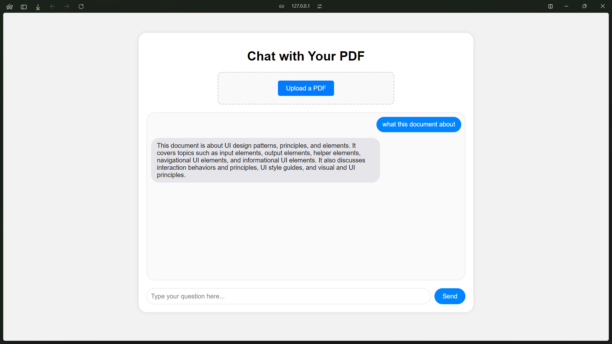

# Chat With `PDFs`

This project is a Flask-based web application that allows users to upload PDF files, extract the text from them, and perform a question-answering process using Google Generative AI and Chroma for vector-based retrieval. The system includes a user-friendly HTML interface for easy interaction.

## Features

- Upload a PDF file and process its content via the web interface.
- Store vectorized embeddings of PDF content using Chroma.
- Use Google Generative AI to answer questions based on the PDF content.
- Retrieve answers using a customizable prompt.

## Requirements

- Python 3.8 or higher
- Google API key (for Google Generative AI and embeddings)
- ChromaDB setup

## Installation

1. Clone the repository:

   ```bash
   git clone https://github.com/Jefino9488/Chat-with-PDF.git
   cd Chat-with-PDF
   ```

2. Create a virtual environment:

   ```bash
   python3 -m venv venv
   ```

3. Activate the virtual environment:

   - On Windows:
     ```bash
     venv\Scripts\activate
     ```
   - On macOS/Linux:
     ```bash
     source venv/bin/activate
     ```

4. Install dependencies:

   ```bash
   pip install -r requirements.txt
   ```

5. Set up environment variables:

   Create a `.env` file with the following content:

   ```
   GOOGLE_API_KEY=your_gemini_api_key
   ```

6. Create the necessary directories:

   ```bash
   mkdir -p uploads db/chroma
   ```

## Usage

1. Run the Flask application:

   ```bash
   python app.py
   ```

2. Visit `http://localhost:5000` in your browser to access the web interface.

3. Upload a PDF using the form provided in the web interface.

4. Ask questions about the uploaded PDF through the provided UI.

## UI Screenshots

Below are some screenshots of the web interface.

*The screen where users can upload their PDF files.*


*The screen where users can ask questions based on the uploaded PDF.*

## Project Structure

```
Chroma_PDF_QA/
├── app.py                     # Flask app
├── templates/
│   └── index.html              # HTML page
├── static/                     # Static assets (CSS, JS, images)
├── uploads/                    # Directory to store uploaded files
├── db/
│   └── chroma/                 # Chroma database storage
├── assets/                     # Directory for UI images/screenshots
├── requirements.txt            # Python dependencies
└── README.md                   # Project documentation
```

## Key Components

- **Chroma**: Used to store and retrieve vector embeddings of PDF content.
- **Google Generative AI**: Provides embeddings and handles QA responses.
- **Flask**: The web framework used for handling routes and requests.
- **HTML UI**: A user-friendly interface for file uploads and querying PDF content.

## Development

- Ensure `debug=True` in `app.py` for development.
- Install any new dependencies using `pip` and update `requirements.txt`:

  ```bash
  pip freeze > requirements.txt
  ```

## License

This project is licensed under the MIT License.

---

